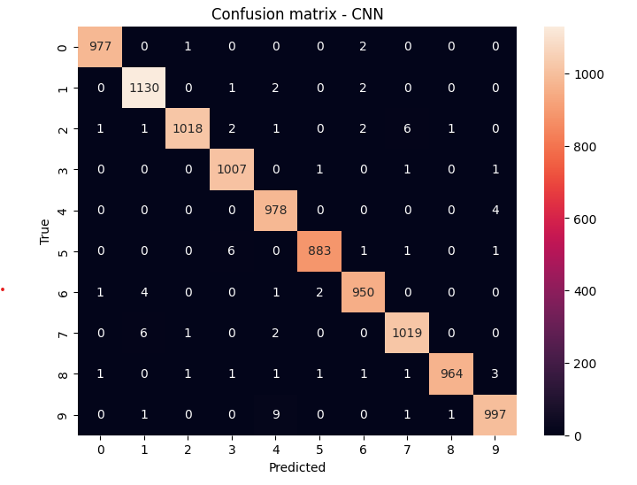

# Deep Learning Lab 2 – CNN, Faster R-CNN, Transfer Learning & Vision Transformer on MNIST

**Abdelmalek Essaadi University**  
**Faculty of Sciences and Techniques of Tangier**  
**Computer Engineering Department – Master SITBD**  
**Module:** Deep Learning  
**Professor:** Pr. ELAACHAK LOTFI  
**Student:** ABABRI Chaimae  

---

## Objective
The main purpose of this lab is to become familiar with the PyTorch library and to build and compare several neural architectures for computer vision on the **MNIST handwritten digit dataset**:
- Custom Convolutional Neural Network (CNN)
- Faster R-CNN (originally for detection, adapted here)
- Transfer Learning with pretrained models (VGG16 & AlexNet)
- Vision Transformer (ViT) implemented from scratch

---

## Dataset
**MNIST Dataset**  
- 60,000 training images + 10,000 test images (28×28 grayscale digits)  
- Source: https://www.kaggle.com/datasets/hojjatk/mnist-dataset  
- Loaded using a custom IDX parser (no torchvision shortcut)

---

## Part 1 – CNN Classifier & Comparisons

### 1. Custom CNN (from scratch)
Lightweight architecture:  
- 3 convolutional blocks (Conv2d → ReLU → BatchNorm → MaxPool)  
- Adaptive average pooling + fully-connected classifier with dropout  

**Results**  
- Test Accuracy: **99.23 %**  
- Test F1-score: **99.23**  
- Training time: **53 seconds** (on GPU)  
- Confusion matrix: almost perfect  

### 2. Faster R-CNN (adapted to classification)
- Used torchvision's Faster R-CNN with MobileNetV3 backbone  
- Converted MNIST into detection format (one artificial bounding box per digit)  
- Fine-tuned for 2 epochs  

**Results**  
- Classification Accuracy: **27.5 %**  
- Training time: ~4.8 seconds  

**Conclusion:** As expected, Faster R-CNN is designed for object detection, not pure classification. Poor performance clearly shows architecture specialization.

### 3. Transfer Learning – VGG16 & AlexNet
Features frozen, only classifier head trained.

| Model         | Test Accuracy | Test F1-score | Training Time (s) | Comments                     |
|---------------|---------------|---------------|-------------------|------------------------------|
| VGG16         | 96.78 %       | 96.74         | 1068              | Extremely slow, overkill     |
| AlexNet       | 95.10 %       | 95.03         | 167               | Faster but lower performance |

---

## Part 2 – Vision Transformer (from scratch)

Implemented following this excellent tutorial:  
https://medium.com/mlearning-ai/vision-transformers-from-scratch-pytorch-a-step-by-step-guide-96c3313c2e0c

Key components:
- Image → Patches (7×7) + linear projection
- Class token + positional embeddings
- 6 Transformer encoder layers
- 8 attention heads
- MLP classification head

**Results**  
- Test Accuracy: **97.27 %**  
- Test F1-score: 97.25  
- Training time: ~85 seconds

---

## Global Comparison

| Model                | Test Accuracy | F1-score | Training Time (s) | Suitability for MNIST          |
|----------------------|---------------|----------|-------------------|--------------------------------|
| **Custom CNN**       | **99.23 %**   | 99.23    | 53                | Best choice                    |
| Vision Transformer  | 97.27 %       | 97.25    | 85                | Very good but unnecessary      |
| VGG16 (TL)           | 96.78 %       | 96.74    | 1068              | Far too heavy                  |
| AlexNet (TL)         | 95.10 %       | 95.03    | 167               | Acceptable                     |
| Faster R-CNN         | 27.50 %       | —        | ~5                | Completely unsuitable          |

---

## What I Learned – Personal Synthesis

During this lab, I gained hands-on experience with:
- Building CNNs from scratch with full control over layers, kernels, stride, padding, optimizers, and regularization
- Understanding the fundamental differences between detection models (Faster R-CNN) and classification models
- Fine-tuning large pretrained networks (VGG16, AlexNet) and realizing that transfer learning is not always beneficial on simple datasets
- Implementing a complete Vision Transformer from scratch (patch embedding, multi-head attention, transformer encoder)
- Training everything on GPU with PyTorch
- Objectively comparing models using accuracy, F1-score, confusion matrices, and training time

**Key takeaway:**  
For small, structured datasets like MNIST, a well-designed lightweight CNN remains the most efficient and accurate solution. Modern heavy architectures (ViT, large pretrained CNNs, detection models) are overkill and often perform worse in terms of speed/accuracy trade-off.

---
